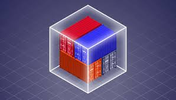
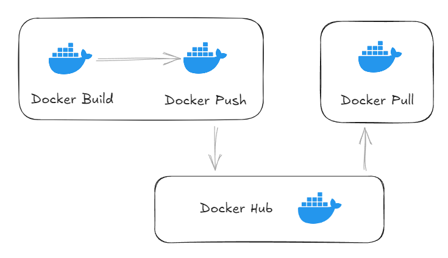
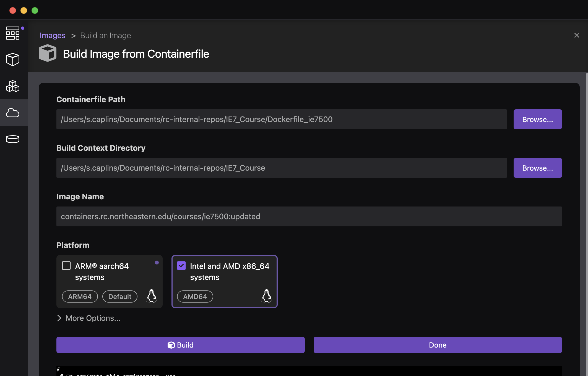

## Scientific Reproducibility III (container images)

Welcome to the final session of the Research Computing Spring 2026 training series. In this training we will be learning more about Scientific Reproducibility, with a focus on software and container images, which can greatly increase the reproducibility and collaboration of your research efforts.

Today this presentation will cover:

1. [What is a container?](#what-is-a-container)
2. [What are some advantages of containers?](#what-are-some-advantages-of-containers)
3. [How to run a container (on CPU or GPU).](#how-to-run-a-container)
4. [Binding directories to your container.](#binding-directories-to-your-container)
5. [How to build a container.](#how-to-build-a-container)
6. [How to pull your container to the cluster.](#how-to-pull-your-container-to-the-cluster)
7. [Some tips and tricks.](#tips-and-tricks)
8. [How to get help](#how-to-get-help)

## What is a container?

[#what-is-a-container](#what-is-a-container)


[](images/containers.jpeg)

A container is a lightweight, portable, self-contained unit of software that packages up an application and all its dependencies — libraries, configuration files, binaries, and runtime — into a single file or image. This means the software inside the container will behave the same way regardless of what machine it is running on.

[](images/lunchbox.avif)

Think of a container as a sealed lunchbox: everything your application needs for lunch is already inside. It doesn't matter where you eat it (the park, a picnic table, work, school, etc) — the contents are the same.

On HPC clusters like Explorer, we use **[Apptainer](https://apptainer.org/)** (formerly known as Singularity) as our container platform. Unlike Docker (which is common on laptops and cloud systems), Apptainer is designed specifically for shared HPC environments where users do not have root (administrator) privileges. Apptainer containers run with your user permissions, making them safe for multi-user clusters.

Container images on the cluster are typically stored as a single `.sif` file (Singularity Image Format).

> **Note:** You may see containers referred to as Docker, Singularity, or Apptainer images in different contexts. On Explorer, we use Apptainer, but Apptainer is fully compatible with Docker images and can pull directly from Docker Hub.

## What are some advantages of containers?

[#what-are-some-advantages-of-containers](#what-are-some-advantages-of-containers)

Containers offer several compelling advantages for scientific computing:

**Reproducibility**

Because the entire software environment is captured inside the container image, your results are tied to a specific, versioned software stack. A collaborator running your container six months from now will get the exact same results you did today — even if the underlying system has been updated.

**Portability**

A container built on your laptop can be run on Explorer, on another HPC cluster, or in the cloud without modification. You write your software environment once and run it anywhere.

**No dependency conflicts**

Have you ever needed two programs that require incompatible versions of the same library? Containers solve this problem because each container carries its own isolated set of dependencies.

**No root required at runtime**

On a shared HPC cluster you do not have administrator privileges. Conda environments and module installs are great for many cases, but containers allow you to install software as if you did have full control — you just do the build step on a machine where you do have permissions (such as your own laptop or a cloud VM), and then bring the finished `.sif` file to Explorer.

**Shareability**

A `.sif` file is a single file that can be shared with collaborators, uploaded to a container registry, or archived with your data for long-term reproducibility. You can point a reviewer directly to the container image used to produce your results.

**Access to community-built images**

Registries like [Docker Hub](https://hub.docker.com/), [Quay.io](https://quay.io/), [NVIDIA NGC](https://catalog.ngc.nvidia.com/), and [BioContainers](https://biocontainers.pro/) host thousands of pre-built, community-maintained images for popular scientific software — saving you the effort of building from scratch.

## How to run a container

[#how-to-run-a-container](#how-to-run-a-container)

Apptainer provides several ways to interact with a container. The three most common subcommands are:

| Command | Description |
| --- | --- |
| `apptainer exec` | Run a specific command inside the container |
| `apptainer shell` | Open an interactive shell inside the container |
| `apptainer run` | Execute the container's default runscript |

### Running a container on CPU

[#running-a-container-on-cpu](#running-a-container-on-cpu)

---

First, request a compute node (do not run containers on the login node):

```
srun --pty bash
```

**Execute a single command:**

```
apptainer run --bind /projects:/projects /projects/seedpod/container/seedpod_latest.sif
```

You will see your prompt change to `Apptainer>`, indicating you are now inside the container. Type `exit` to leave.

The image shown above is from this bioinformatics project called seedpod: https://github.com/northeastern-rc-internal/seedpod

**Using a container in an sbatch script (CPU):**

```
#!/bin/bash
#SBATCH -J container_job
#SBATCH -p short
#SBATCH -N 1
#SBATCH -n 8
#SBATCH --mem=32GB
#SBATCH --time=04:00:00
#SBATCH --mail-user=s.caplins@northeastern.edu
#SBATCH --mail-type=ALL

# Run the container
apptainer exec \
  --bind /projects:/projects \
  /projects/myproject/containers/myimage.sif \
  python /data/myscript.py
```

Save this script (e.g., `run_container.sh`) and submit it with:

```
sbatch run_container.sh
```

### Running a container on GPU

[#running-a-container-on-gpu](#running-a-container-on-gpu)

---

Containers are especially powerful for GPU workloads because they allow you to bundle a specific version of CUDA and cuDNN into the image itself — no need to worry about which CUDA modules are installed on the system.

To give the container access to the host GPU, add the `--nv` flag to your Apptainer command:

```
apptainer exec --nv --bind /projects:/projects myimage.sif python train.py
```

**Interactive GPU session with a container:**

```
srun --partition=gpu-interactive --gres=gpu:v100-sxm2:1 \
  --ntasks=4 --mem=16GB --time=02:00:00 --nodes=1 --pty bash
```

Once on the compute node:

```
apptainer exec --nv --bind /projects:/projects myimage.sif python train.py
```

**GPU container job via sbatch:**

```
#!/bin/bash
#SBATCH -J gpu_container_job
#SBATCH -p gpu
#SBATCH -N 1
#SBATCH --gres=gpu:v100-sxm2:2
#SBATCH --cpus-per-task=8
#SBATCH --mem=64GB
#SBATCH --time=12:00:00
#SBATCH --mail-user=s.caplins@northeastern.edu
#SBATCH --mail-type=ALL

apptainer exec --nv \
  --bind /projects:/projects \
  /projects/myproject/containers/pytorch_image.sif \
  python /data/train.py --epochs 50 --batch-size 64
```

> **Tip:** NVIDIA maintains an excellent collection of pre-built GPU-optimized container images (PyTorch, TensorFlow, RAPIDS, and more) on the [NGC Catalog](https://catalog.ngc.nvidia.com/). These are a great starting point for deep learning workflows and are regularly updated with optimized CUDA builds.

> **Note:** The `--nv` flag passes through the host GPU drivers to the container. The CUDA version inside the container must be compatible with the GPU driver version on the host node. Check compatible driver versions in the [CUDA release notes](https://docs.nvidia.com/cuda/cuda-toolkit-release-notes/).

## Binding directories to your container

[#binding-directories-to-your-container](#binding-directories-to-your-container)

By default, a container runs in an isolated filesystem and cannot see the files on your host system (the cluster). To give your container access to data stored in your `/scratch`, or `/projects` directories, you need to **bind** those directories into the container. Your `/home` directory is the only directory automatically bound to the container when you run it.

This is done with the `--bind` (or `-B`) flag.

**Basic syntax:**

```
apptainer run --bind /source/on/host:/destination/in/container myimage.sif 
```

**Example — binding your projects directory:**

```
apptainer run --bind /projects:/projects myimage.sif
```

Here, `/projects` on the cluster is made available inside the container at the path `/projects`.

**Binding multiple directories at once:**

```
apptainer run \
  --bind /projects:/projects \
  --bind /scratch:/scratch \
  myimage.sif
```

**Using environment variables:**

Apptainer also respects the `APPTAINER_BIND` environment variable, which can be convenient in scripts:

```
export APPTAINER_BIND="/projects:/projects,/scratch:/scratch,/shared:/shared,/courses:/courses"
apptainer exec -B $APPTAINER_BIND myimage.sif python /projects/myspace/myscript.py
```

> **Note:** Your `/home` directory is automatically bound into the container by default on Explorer. However, `/projects` and `/scratch` are **not** bound by default and must be specified explicitly. Always use absolute paths when binding.


## How to build a container

[#how-to-build-a-container](#how-to-build-a-container)

Building a container requires root (administrator) access, which is not available on Explorer. You have two options for building containers:

- **Build locally** on your own laptop or workstation (requires Docker or Podman or Apptainer installed).
- **Build remotely** using the Apptainer Remote Builder or a cloud VM.

### Writing a Definition File (`.def`)

[#writing-a-definition-file](#writing-a-definition-file)

An Apptainer definition file (also called a "def file") is a text recipe that describes how to build your container image. It is analogous to a Dockerfile for Docker.

Here is a simple example that creates a Python environment with `numpy` and `pandas`:

```
Bootstrap: docker
From: python:3.11-slim

%post
    pip install numpy pandas scipy matplotlib

%runscript
    echo "Container is ready. Python version:"
    python --version

%labels
    Author s.caplins@northeastern.edu
    Version 1.0

%help
    This container provides a Python 3.11 environment
    with numpy, pandas, scipy, and matplotlib installed.
```

Key sections of a definition file:

| Section | Purpose |
| --- | --- |
| `Bootstrap` / `From` | The base image to start from (e.g., Docker Hub image) |
| `%post` | Commands to run during the build (install software, configure environment) |
| `%runscript` | Commands executed when you use `apptainer run` |
| `%environment` | Environment variables set at runtime |
| `%labels` | Metadata (author, version, etc.) |
| `%help` | Help text shown with `apptainer run-help` |

### Building with Docker or Podman (on your laptop)

[#building-with-docker](#building-with-docker)

If you have Docker or Podman installed locally, you can build a Container image and convert it to a `.sif` file:

[](images/docker_build.png)

This requires a Dockerfile or Container file. Here is an example format for a Container file:

```Dockerfile
FROM rockylinux:9.3

# Set up environment
ENV LANG en_US.UTF-8
ENV LANGUAGE en_US.UTF-8
ENV LC_ALL en_US.UTF-8
ENV CDP_VERSION="1.2.3"
ENV INSTALL_PREFIX="/opt/cdpkit"

# Update the system and install packages
RUN dnf -y update && dnf -y install \
    epel-release dnf-plugins-core glibc-langpack-en\
    texlive \
    openssh-clients \
    gcc-c++ \
    make \
    python3 \
    python3-pip \
    vim \
    nano \
    wget \
    cmake \
    make \
    tar \
    qt5-qtbase-devel \
    gcc \
    git \
    gcc-c++ \
    tar \
    boost-devel \
    boost-python3-devel \
    gmp-devel \
    cairo-devel \
    gcc-toolset-13 \
    && dnf clean all


# Note: There's no direct equivalent for python3-sphinx-tabs in Rocky,
# so we're installing it via pip instead
RUN pip install sphinx

SHELL ["/bin/bash", "-c"]
ENV PATH="/opt/rh/gcc-toolset-13/root/usr/bin:${PATH}"

# Install CDPKit Python bindings
RUN pip3 install CDPKit

# Verify installation
RUN python3 -c "import CDPL; print('CDPKit installed successfully')"

CMD ["/bin/bash"]
```
Once your Containerfile is written you can try to build it.
```
# Build a Docker image
docker build -t myimage:1.0 .

# push that image to docker hub or other repo

# Convert Docker image to Apptainer .sif (requires Apptainer installed locally)
apptainer build myimage.sif docker-daemon://myimage:1.0

```
[](images/podman.png)

Alternatively, push to Docker Hub and pull from there (see the next section).

### Using the Apptainer Remote Builder

[#using-the-apptainer-remote-builder](#using-the-apptainer-remote-builder)

Apptainer provides a free [Remote Build Service](https://cloud.sylabs.io/builder) that lets you build containers in the cloud — no local root access required. Create a free account at [cloud.sylabs.io](https://cloud.sylabs.io/) and then:

```
apptainer build --remote myimage.sif myimage.def
```

> **Note:** Building large or complex images on the Remote Builder can take a few minutes. If your build fails, carefully read the error messages — they usually point directly to the problem (a missing package, a typo in a library name, etc.).

## How to pull your container to the cluster

[#how-to-pull-your-container-to-the-cluster](#how-to-pull-your-container-to-the-cluster)

Once you have built or found a container image, you need to get it onto Explorer. There are a few ways to do this.

[](images/docker_build.png)

### Pulling from Docker Hub

[#pulling-from-docker-hub](#pulling-from-docker-hub)

Apptainer can pull Docker images directly from [Docker Hub](https://hub.docker.com/) and convert them to `.sif` format on the fly. First, get a compute node so you are not pulling on a login node:

```
srun --pty bash
```

Then pull the image:

```
apptainer pull docker://ubuntu:22.04
```

This will produce a file called `ubuntu_22.04.sif` in your current directory.

You can also specify a custom output name:

```
apptainer pull --name myubuntu.sif docker://ubuntu:22.04
```

**Pulling a specific tool — for example, GATK from Docker Hub:**

```
apptainer pull docker://broadinstitute/gatk:4.5.0.0
```

**Pulling a GPU-optimized image from NVIDIA NGC:**

```
apptainer pull docker://nvcr.io/nvidia/pytorch:24.01-py3
```

### Pulling from the Sylabs Cloud Library

[#pulling-from-the-sylabs-cloud-library](#pulling-from-the-sylabs-cloud-library)

```
apptainer pull library://lolcow
```

### Transferring a locally built `.sif` file

[#transferring-a-locally-built-sif-file](#transferring-a-locally-built-sif-file)

If you built the container on your laptop, you can transfer the `.sif` file to Explorer using `scp` via the transfer node:

```
scp myimage.sif s.caplins@xfer.discovery.neu.edu:/projects/myproject/containers/
```

Or use the [OOD Files application](https://ood.explorer.northeastern.edu) to upload files up to 10 GB.

> **Tip:** We recommend storing your `.sif` files in your `/projects` directory so they are available to all members of your lab and are not subject to the `/home` 75 GB quota.

> **Tip:** Keep your `.def` (definition) files alongside your `.sif` files in your project directory. The `.def` file is a complete record of how the container was built and is important for reproducibility. Committing the `.def` file to a version-controlled repository (like GitHub) is excellent scientific practice.

## Tips and tricks

[#tips-and-tricks](#tips-and-tricks)

### Setting a default bind path

[#setting-a-default-bind-path](#setting-a-default-bind-path)

Rather than typing `--bind` every time, you can set the `APPTAINER_BIND` environment variable in your `~/.bashrc` (though note the general caution about `.bashrc` from the software module session):

```
export APPTAINER_BIND="/projects:/projects,/scratch/:/scratch,/shared:/shared,/courses:/courses"
```

### Setting a cache directory

[#setting-a-cache-directory](#setting-a-cache-directory)

When Apptainer pulls or builds images, it stores temporary files in a cache directory, which by default is in your `/home`. If you are pulling large images this can quickly fill your home quota. We recommend checking your `/home` quota regularily and deleting the .apptainer cache regularily (a new .apptainer will be created by apptainer the next time you need it).

```
/home/s.caplins/.apptainer
```

### Testing your container interactively first

[#testing-your-container-interactively-first](#testing-your-container-interactively-first)

Before submitting a long sbatch job, always test your container interactively on a compute node. This helps you catch errors quickly:

```
srun --pty bash
apptainer shell --bind /projects:/projects myimage.sif
# test your commands here
exit
```

### BioContainers for bioinformatics tools

[#biocontainers-for-bioinformatics-tools](#biocontainers-for-bioinformatics-tools)

If you work in bioinformatics, [BioContainers](https://biocontainers.pro/) provides community-maintained containers for thousands of bioinformatics tools. Each tool version has its own container, making it easy to use and cite an exact software version. You can search for images at [biocontainers.pro](https://biocontainers.pro/) and pull them directly:

```
apptainer pull docker://biocontainers/samtools:v1.9-4-deb_cv1
```

### Containers in a workflow manager

[#containers-in-a-workflow-manager](#containers-in-a-workflow-manager)

Workflow managers like [Nextflow](https://www.nextflow.io/) and [Snakemake](https://snakemake.readthedocs.io/) have built-in support for running individual steps inside specified containers. This is one of the most powerful patterns for reproducible scientific pipelines, as each tool in your workflow can run in its own container. Ask the RC team if you would like help setting this up.

## How to get help

[#how-to-get-help](#how-to-get-help)

Email the Research Computing team at [rchelp@northeastern.edu](mailto:rchelp@northeastern.edu).

Come to [office hours](https://rc.northeastern.edu/getting-help/) hosted on Zoom.

Or [book a consultation](https://rc.northeastern.edu/getting-help/) with an RC team member.

Review our [documentation on containers](https://rc-docs.northeastern.edu/en/latest/containers/index.html) for more detailed guides and examples.

Thank you for joining the Research Computing Spring 2026 Training Series!

---

*For questions or support, contact the Research Computing team at [rchelp@northeastern.edu](mailto:rchelp@northeastern.edu)*